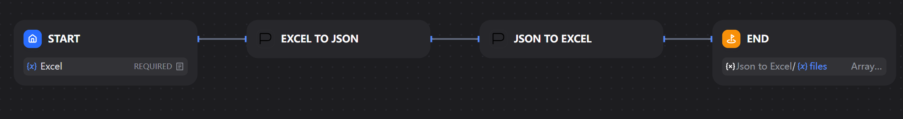
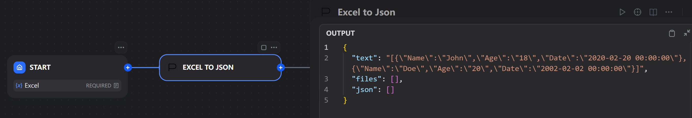
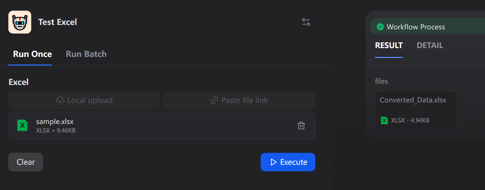
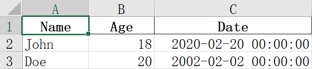

# Excel ↔ Json Converter

**Author:** qiangxinglin

**Version:** 0.0.3

**Type:** tool

**Repository** https://github.com/qiangxinglin/excel-dify-plugin

## Description

The built-in `Doc Extractor` would convert input `.xlsx` file to markdown table **string** for downstream nodes (e.g. LLM). But this does not cover all situations! This plugin provides 2 tools:
- `xlsx → json`: Read the Excel file and output the Json presentation of the data.
- `json → xlsx`: Convert the given json string (list of records) to xlsx blob.

## Usage
> [!IMPORTANT]
> Correctly configure the **`FILES_URL`** in your `docker-compose.yaml` or [`.env`](https://github.com/langgenius/dify/blob/main/docker/.env.example#L48) in advance.

## Tools

### xlsx → json

- The output is placed in the `text` output field rather than the `json` field in order to preserving the header order.
- All cells are parsed as **string**, no matter what it is.
- If the uploaded Excel file contains multiple sheets, the plugin will automatically convert it into a JSON object, where each key is the sheet name and the value is the data array of the corresponding sheet.

| Name | Age | Date |
|------|-----|------|
| John |  18 |2020/2/20|
| Doe  |  20 |2020/2/2|

### json → xlsx

- The output filename can be configured, default `Converted_Data`
- If the input JSON is an object (whose values are arrays), the plugin will automatically create a multi-sheet Excel file, where each key of the object will become a sheet name.

## Used Open sourced projects

- [pandas](https://github.com/pandas-dev/pandas), BSD 3-Clause License

## Changelog
- **0.0.4**: Add missing dependency (xlrd)
- **0.0.3**: Add multi-sheet support for Excel processing (closes #13)

## License
- Apache License 2.0

## Privacy

This plugin collects no data.

All the file transformations are completed locally. NO data is transmitted to third-party services.